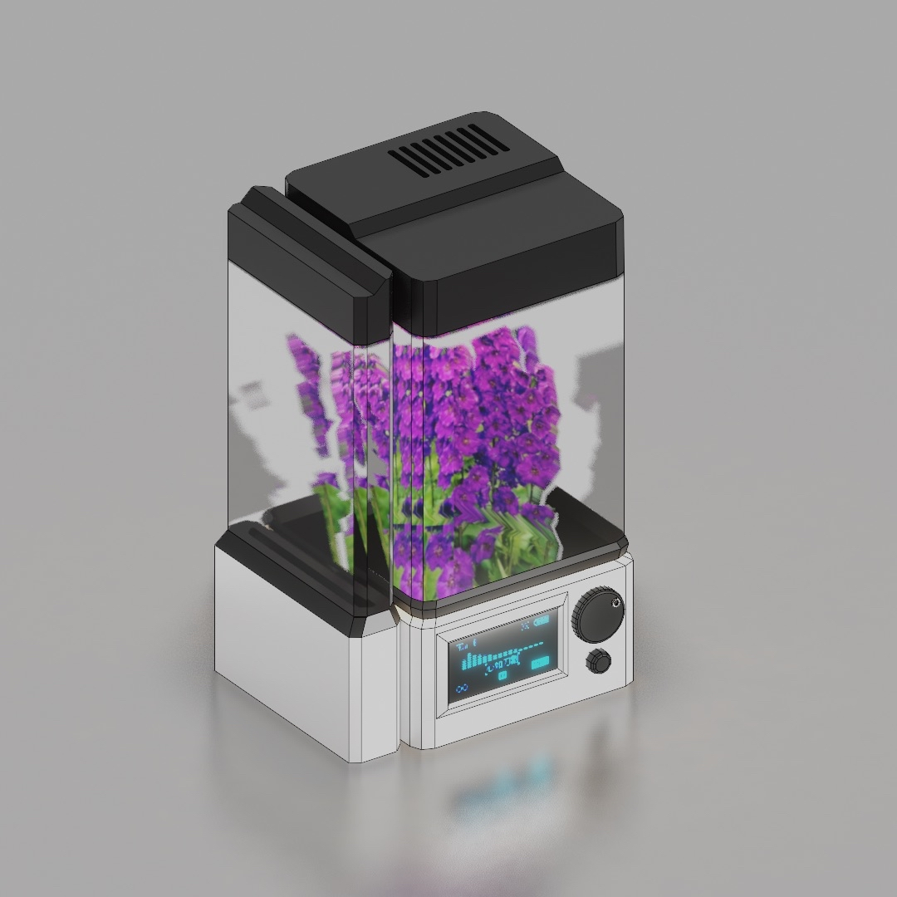

# Irrig — Smart Irrigation System

## What is Irrig?
Irrig is a smart irrigation system that holds a plant or terrarium in its casing. The system will use a moisture, or hydration sensor, to track the water content and turn on a water pump when the moisture levels drop below an environment-specific threshold tailored for specific plants. This product would be suitable for terrestrial plants (plants that grow in or from land/soil), and lithophytic plants (plants that grow on rocks or tree bark). 

  

The plan for this project is to be able to produce multiple copies of a working product so that people can use them in their spaces. We have already tested out some of the components to make sure they work as expected, but need to look into how we will use them for our product. For example, the moisture sensor outputs higher values when fully submerged in water and lower values when taken out of the water, but we want to track what these values are when the sensor is put in soil and be able to set moisture levels for different plants. We hope this product will make it easy for people to keep greenery in their spaces, creating a calming, welcoming atmosphere without the stress of constant care.

---

## How it works

Multiple Irrig “cells” will be able to be connected wirelessly by placing them next to each other and will be able to transmit and receive data through infrared or wired I2C communication. The neighboring screenless “dummy cells” will be able to have their plant’s parameters programmed through a singular “smart cell”.

An OLED display will show the moisture contents on a graph with respect to time and have moisture level options for the user to select with a rotary encoder. An ESP32 is being used as the microcontroller for this project. It drives the moisture sensors, humidity sensors, relays for water pump/humidifier, OLED display, LED lights, UV lights, IR transmitters/receivers, and rotary encoder. C and C++ is the primary language being used for this project and the thread manager being used is FreeRTOS.

---

**Authors:**  
Fariha Khan, Ren Ellis, Chris Morgado